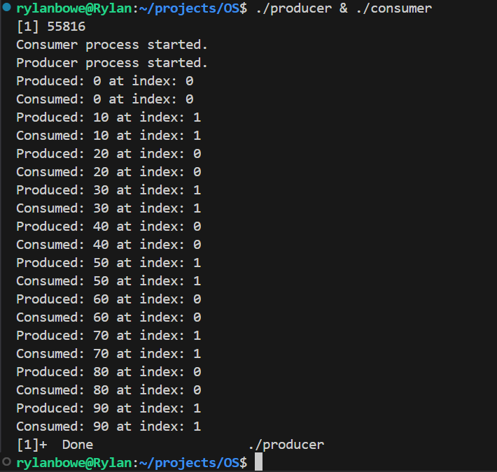

# Producer-Consumer project for Operating systems (CS 33211)

This project solves the **Producer-Consumer** problem using:

- Shared Memory: shm_open() and mmap()
- POSIX named semaphores: sem_open()
- producer.cpp and consumer.cpp are seperate processes that share memory

# What is the producer-consumer problem?
Two separate processes (or threads) share access to a buffer of arbitrary size. The producer writes to the buffer and the consumer reads from the buffer. Hence the reason this is called the producer-consmer problem. **The producer should not write data if the buffer is full** and **the consumer should not read data if the buffer is empty**. Also **the producer and consumer operations should not happen simultaneosuly** to avoid data inconsistency and undefined behavior. To avoid simultaneous access to the the buffer, mutual exclusion must be achieved. The solution to the problem lies in finding a way to synchronize the processes in sucha way that satisfies the three previously mentioned requirements, so that the cooperating processes execute as intended.

## Brief explanation as to how it works

- **Producer** writes to buffer (i.e produces data)
- **Consumer** reads from buffer (i.e consumes data)
- **Mutual exclusion** needs to be guaranteed to protect critical section (shared memory region), so:
    - **Semaphores** are used to control access to shared buffer (**Critical Section**):
        - 'empty' used to keep track of empty slots in buffer (so producer doesn't produce when buffer is full)
        - 'full' used to keep track of occupied slots in buffer (so consumer doesn't consumer when the buffer is empty)
        - 'mutex' used to ensure that only one process is modifying the buffer at a given moment

**How the processes share memory and semaphores:**
- **memory:**
    - A shared memory object is created with shm_open()
    - O_CREAT passed in both **producer.cpp** and **consumer.cpp**, first process to execute shm_open() creates shared memory region
    - mmap() is used to map process memory space to shared memory space
- **semaphores:**
    - semaphore objects are created with sem_open()
    - same story with O_CREAT, first process to execute sem_open() creates semaphores that will be shared among processes
    - semaphores are indentified by name: SEM_EMPTY_NAME, SEM_FULL_NAME, SEM_MUTEX_NAME

- **Cleanup** for both processes:
    - sem_close() and sem_unlink() used to close and unlink semaphores
    - munmap() is used to unmap shared memory from process memory space
    - close() closes shared memory region
    - shm_unlink() used to unlink shared memory region

## How to run the project

- **To compile:**
    - g++ producer.cpp -o producer -pthread
    - g++ consumer.cpp -o consumer -pthread

- **To run:** 
    - ./producer & ./consumer

## Example output after compilation and execution:

